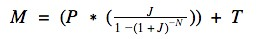
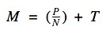

Description 
============

> For this assignment, you will implement a single-activity Android application using a handful of basic controls. The goal of the assignment is to become familiar with the use of Android Studio, basic UI elements, and the Android documentation.

View Layout 
============

> The view will have the following elements:

Amount Borrowed 
----------------

> This will be [a](http://developer.android.com/reference/android/widget/EditText.html)[EditText](http://developer.android.com/reference/android/widget/EditText.html)[(Links to an external site.)](http://developer.android.com/reference/android/widget/EditText.html)into which the user will enter the amount to be borrowed as a floating-point value
>
> (e.g., “1000.00”).

Interest Rate 
--------------

> This will be a [EditText](http://developer.android.com/reference/android/widget/EditText.html)[(Links to an external site.)](http://developer.android.com/reference/android/widget/EditText.html)into which the user will enter the interest rate range from 0.0% to 20.0%. Set initial value to 7.0%.

Loan Term 
----------

> This will be a[RadioGroup](http://developer.android.com/reference/android/widget/RadioGroup.html)[(Links to an external site.)](http://developer.android.com/reference/android/widget/RadioGroup.html)with the choices 7, 15, and 30 representing the number of years of the loan. 30 is selected as default.

Taxes and Insurance 
--------------------

> This will be a[CheckBox](http://developer.android.com/reference/android/widget/CheckBox.html)[(Links to an external site.)](http://developer.android.com/reference/android/widget/CheckBox.html)that allows the user to select whether taxes and insurance are to be included in the monthly payment. When checked, each month borrower will pay additional 0.1% of the total loan amount.

Calculate 
----------

> This will be a[Button](http://developer.android.com/reference/android/widget/Button.html)[(Links to an external site.)](http://developer.android.com/reference/android/widget/Button.html)that, when pressed, will calculate the user’s monthly payments based on the values entered.
>
> **Monthly Payment**
>
> This will be a[TextView](http://developer.android.com/reference/android/widget/TextView.html)[(Links to an external site.)](http://developer.android.com/reference/android/widget/TextView.html)or disabled EditText that displays the monthly payment.

Calculation 
============

> For interest rates other than 0%, the monthly payment can be calculated as:
>
> 
>
> Where:
>
> P = Principal (the amount borrowed)
>
> J = Monthly interest in decimal form (annual interest rate / 1200)
>
> N = Number of months of the loan
>
> T = Monthly taxes and insurance, if selected (0.1% of the amount borrowed) For interest rates of 0%, the monthly payment is simply:

 
=========================================================

Other Requirements 
===================

-   The app shouldn't crash on user input errors, such as if no values are specified and the user clicks the Calculate button.  App should check for invalid user input (e.g., negative loan amount, out-of-range interest rate)  App should use[Toast message](http://developer.android.com/guide/topics/ui/notifiers/toasts.html)[(Links to an external site.)](http://developer.android.com/guide/topics/ui/notifiers/toasts.html)to report any user input errors.

-   App should use linear layouts and should avoid using fixed sized widget or layouts.

-   App will be tested in both landscape mode and portrait mode and possibly with different screen sizes.
